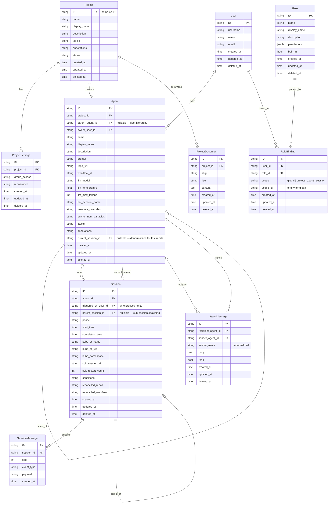

# Agent API

**Date:** 2026-03-10
**Status:** Approved for Implementation

---

## Overview

The Ambient API server provides a coordination layer for orchestrating fleets of persistent agents across projects. The central model is the separation of **Agent** from **Session**:

- **Agent** — a persistent definition that can be ignited into many sessions over its lifetime
- **Session** — an ephemeral Kubernetes execution run, created exclusively via agent ignition

This separation enables re-ignition, run history, fleet persistence, and collaborative sharing across agents.

---

## Entity Relationship Diagram



---

## Agent vs Session

The existing `Session` model conflates two distinct concerns. The API separates them:

| Category | Fields | Entity |
|---|---|---|
| **Identity** | `name`, `prompt`, `repo_url`, `llm_model`, `llm_temperature`, `llm_max_tokens`, `bot_account_name`, `owner_user_id`, `project_id`, `labels`, `annotations`, `resource_overrides`, `environment_variables`, `workflow_id` | `Agent` — persists forever |
| **Run state** | `phase`, `start_time`, `completion_time`, `kube_cr_name`, `kube_cr_uid`, `kube_namespace`, `sdk_session_id`, `sdk_restart_count`, `conditions`, `reconciled_repos`, `reconciled_workflow` | `Session` — ephemeral |

### Agent Lifecycle

```
Agent  ──ignite──►  Session  ──runs──►  completes / fails
  │                    │
  │◄── current_session_id (denormalized)
  │
  └── ignite again ──►  new Session
                            │
                        prior Session preserved in history
```

### Hierarchical Fleets

`parent_agent_id` makes fleet topologies first-class:

```
Project
  └── Agent: "Overlord"
        ├── Agent: "API"
        ├── Agent: "FE"
        └── Agent: "CP"
              └── Agent: "Reviewer"
```

---

## CLI Reference (`acpctl`)

### API ↔ CLI Mapping

#### Projects

| REST API | `acpctl` Command | Notes |
|---|---|---|
| `GET /projects` | `acpctl get projects` | Table output; `-o json` for full JSON |
| `GET /projects/{id}` | `acpctl get project <name>` | |
| `POST /projects` | `acpctl create project --name <n> [--display-name <d>] [--description <d>]` | |
| `DELETE /projects/{id}` | `acpctl delete project <name>` | Interactive confirmation; `-y` to skip |
| _(context switch)_ | `acpctl project <name>` | Sets current project context in `~/.acpctl/config.yaml` |
| _(context view)_ | `acpctl project current` | Shows active project context |

#### Agents

| REST API | `acpctl` Command | Notes |
|---|---|---|
| `GET /agents` | `acpctl get agents` | |
| `GET /agents/{id}` | `acpctl get agent <id>` | |
| `POST /agents` | `acpctl create agent --name <n> --project-id <p> --owner-user-id <u> [--prompt <p>] [--repo-url <r>] [--model <m>]` | |
| `POST /agents/{id}/ignite` | `acpctl start <agent-id>` | Returns session + ignition prompt |
| `POST /agents/{id}/inbox` | `acpctl create agent-message --recipient-agent-id <id> --body <text>` | |

#### Sessions

| REST API | `acpctl` Command | Notes |
|---|---|---|
| `GET /sessions` | `acpctl get sessions` | Table: ID, NAME, PROJECT, PHASE, MODEL, AGE |
| `GET /sessions` | `acpctl get sessions -w` | Live watch mode |
| `GET /sessions/{id}` | `acpctl get session <id>` | |
| `GET /sessions/{id}` | `acpctl describe session <id>` | Full JSON output |
| `DELETE /sessions/{id}` | `acpctl delete session <id>` | Also `acpctl stop <id>` |

#### RBAC

| REST API | `acpctl` Command | Notes |
|---|---|---|
| `POST /roles` | `acpctl create role --name <n> [--permissions <json>]` | |
| `POST /role_bindings` | `acpctl create role-binding --user-id <u> --role-id <r> --scope <s> [--scope-id <id>]` | |

#### Auth & Context

| Operation | `acpctl` Command |
|---|---|
| Authenticate | `acpctl login [SERVER_URL] --token <t>` |
| Log out | `acpctl logout` |
| Identity | `acpctl whoami` |

---

## API Reference

### Projects

```
GET    /api/ambient/v1/projects/{id}/agents               list agents in project (tree structure)
GET    /api/ambient/v1/projects/{id}/documents            list project documents
GET    /api/ambient/v1/projects/{id}/documents/{slug}     read document by slug
PUT    /api/ambient/v1/projects/{id}/documents/{slug}     upsert document by slug
DELETE /api/ambient/v1/projects/{id}/documents/{slug}     delete document
GET    /api/ambient/v1/projects/{id}/role_bindings        RBAC bindings scoped to this project
```

### Agents

```
GET    /api/ambient/v1/agents                             list all agents
GET    /api/ambient/v1/agents/{id}                        read agent
POST   /api/ambient/v1/agents                             create agent
PATCH  /api/ambient/v1/agents/{id}                        update agent definition
DELETE /api/ambient/v1/agents/{id}                        delete agent

GET    /api/ambient/v1/agents/{id}/sessions               run history for this agent
GET    /api/ambient/v1/agents/{id}/ignition               preview ignition prompt (dry run)
POST   /api/ambient/v1/agents/{id}/ignite                 ignite — creates a Session

GET    /api/ambient/v1/agents/{id}/inbox                  read inbox (unread first)
POST   /api/ambient/v1/agents/{id}/inbox                  send message to this agent
PATCH  /api/ambient/v1/agents/{id}/inbox/{msg_id}         mark message as read
DELETE /api/ambient/v1/agents/{id}/inbox/{msg_id}         delete message

GET    /api/ambient/v1/agents/{id}/role_bindings          RBAC bindings scoped to this agent
```

#### Ignite Response

`POST /api/ambient/v1/agents/{id}/ignite` returns both the created session and an assembled ignition prompt:

```json
{
  "session": {
    "id": "2abc...",
    "agent_id": "1def...",
    "phase": "pending",
    "triggered_by_user_id": "...",
    "created_at": "2026-03-10T19:00:00Z"
  },
  "ignition_prompt": "# Agent: API\n\nYou are API, working in project sdk-backend-replacement...\n\n## Peer Agents\n..."
}
```

### Sessions

Sessions are **not directly creatable** — they are created exclusively via `POST /agents/{id}/ignite`.

```
GET    /api/ambient/v1/sessions/{id}                      read session
DELETE /api/ambient/v1/sessions/{id}                      cancel or delete session

GET    /api/ambient/v1/sessions/{id}/messages             SSE AG-UI event stream
GET    /api/ambient/v1/sessions/{id}/role_bindings        RBAC bindings scoped to this session
```

---

## RBAC

### Scopes

| Scope | Meaning |
|---|---|
| `global` | Applies across the entire platform |
| `project` | Applies to all agents and sessions in a project |
| `agent` | Applies to one agent and all its sessions |
| `session` | Applies to one session run only |

Effective permissions = union of all applicable bindings. No deny rules.

### Built-in Roles

| Role | Description |
|---|---|
| `platform:admin` | Full access to everything |
| `platform:viewer` | Read-only across the platform |
| `project:owner` | Full control of a project and all its agents |
| `project:editor` | Create/update agents, send messages |
| `project:viewer` | Read-only within a project |
| `agent:operator` | Update and ignite a specific agent |
| `agent:observer` | Read a specific agent and its sessions |
| `agent:runner` | Minimum viable pod credential: read agent, send messages |

### RBAC Endpoints

```
GET    /api/ambient/v1/roles
POST   /api/ambient/v1/roles
PATCH  /api/ambient/v1/roles/{id}
DELETE /api/ambient/v1/roles/{id}

GET    /api/ambient/v1/role_bindings
POST   /api/ambient/v1/role_bindings
DELETE /api/ambient/v1/role_bindings/{id}
```

---

## Design Decisions

| Decision | Rationale |
|---|---|
| Agent is persistent, Session is ephemeral | Agent identity survives runs; execution state does not |
| `parent_agent_id` on Agent | Fleet hierarchies are first-class in the data model |
| `current_session_id` denormalized on Agent | Fast reads without joining through sessions |
| `AgentMessage` inbox on Agent, not Session | Messages persist across re-ignitions |
| Sessions created only via ignite | Sessions are run artifacts; direct `POST /sessions` is removed |
| Four-scope RBAC | Agent scope enables sharing one agent without exposing the whole project |
| `agent:runner` role | Pods get the minimum viable credential |
| Union-only permissions | No deny rules — simpler mental model for fleet operators |
| `ProjectDocument` upserted by slug | Pages are edited in-place |
