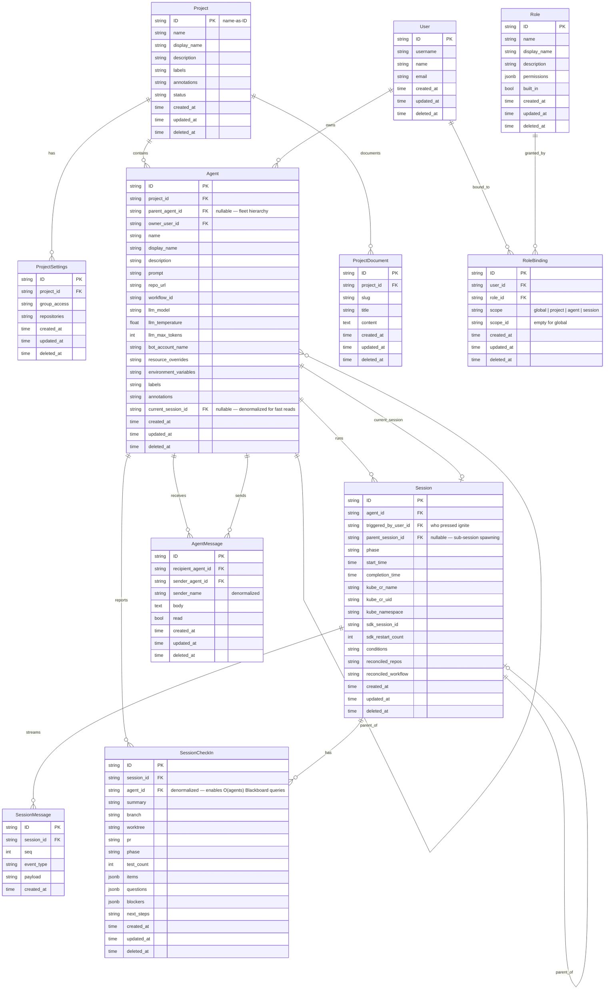

# Blackboard Coordination API

**Date:** 2026-03-10
**Status:** Approved for Implementation

---

## Overview

The Ambient API server provides a **Blackboard** coordination layer for orchestrating fleets of persistent agents across projects. The central model is the separation of **Agent** from **Session**:

- **Agent** — a persistent definition that can be ignited into many sessions over its lifetime
- **Session** — an ephemeral Kubernetes execution run, created exclusively via agent ignition

This separation enables re-ignition, run history, fleet persistence, and collaborative sharing across agents.

The Blackboard itself is a project-scoped live dashboard: every agent's latest check-in is visible in real time via SSE, enabling human operators and orchestrator agents ("Overlord") to monitor and coordinate a fleet.

---

## Entity Relationship Diagram



---

## Agent vs Session

The existing `Session` model conflates two distinct concerns. The Blackboard API separates them:

| Category | Fields | Entity |
|---|---|---|
| **Identity** | `name`, `prompt`, `repo_url`, `llm_model`, `llm_temperature`, `llm_max_tokens`, `bot_account_name`, `owner_user_id`, `project_id`, `labels`, `annotations`, `resource_overrides`, `environment_variables`, `workflow_id` | `Agent` — persists forever |
| **Run state** | `phase`, `start_time`, `completion_time`, `kube_cr_name`, `kube_cr_uid`, `kube_namespace`, `sdk_session_id`, `sdk_restart_count`, `conditions`, `reconciled_repos`, `reconciled_workflow` | `Session` — ephemeral |

### Agent Lifecycle

```
Agent  ──ignite──►  Session  ──runs──►  completes / fails
  │                    │
  │◄── current_session_id (denormalized)
  │
  └── ignite again ──►  new Session
                            │
                        prior Session preserved in history
```

`current_session_id` is a denormalized pointer updated on every ignite and on session completion. It enables the Blackboard snapshot to read `Agent + latest SessionCheckIn` without joining through sessions.

### Hierarchical Fleets

`parent_agent_id` makes fleet topologies first-class:

```
Project
  └── Agent: "Overlord"
        ├── Agent: "API"
        ├── Agent: "FE"
        └── Agent: "CP"
              └── Agent: "Reviewer"
```

Each agent has its own run history, inbox, and check-in timeline. The Blackboard renders this as a collapsible tree.

---

## CLI Reference (`acpctl`)

The `acpctl` CLI mirrors the API 1-for-1. Every REST operation has a corresponding command. The CLI is implemented in `components/ambient-cli/`.

### API ↔ CLI Mapping

#### Projects

| REST API | `acpctl` Command | Notes |
|---|---|---|
| `GET /projects` | `acpctl get projects` | Table output; `-o json` for full JSON |
| `GET /projects/{id}` | `acpctl get project <name>` | |
| `POST /projects` | `acpctl create project --name <n> [--display-name <d>] [--description <d>]` | |
| `PATCH /projects/{id}` | _(not yet exposed)_ | |
| `DELETE /projects/{id}` | `acpctl delete project <name>` | Interactive confirmation; `-y` to skip |
| _(context switch)_ | `acpctl project <name>` | Sets current project context in `~/.acpctl/config.yaml`; validated against live API |
| _(context view)_ | `acpctl project current` | Shows active project context |
| _(list shorthand)_ | `acpctl project list` | Alias for `get projects` with name-focused columns |
| `GET /projects/{id}/agents` | `acpctl get agents --project-id <id>` | _(planned)_ |
| `GET /projects/{id}/documents` | _(not yet exposed)_ | |
| `GET /projects/{id}/documents/{slug}` | _(not yet exposed)_ | |
| `PUT /projects/{id}/documents/{slug}` | _(not yet exposed)_ | |
| `GET /projects/{id}/blackboard` | _(not yet exposed)_ | SSE stream |
| `GET /projects/{id}/blackboard/snapshot` | _(not yet exposed)_ | |

#### Agents

| REST API | `acpctl` Command | Notes |
|---|---|---|
| `GET /agents` | `acpctl get agents` | _(planned; resource type registered)_ |
| `GET /agents/{id}` | `acpctl get agent <id>` | |
| `POST /agents` | `acpctl create agent --name <n> --project-id <p> --owner-user-id <u> [--prompt <p>] [--repo-url <r>] [--model <m>] [--display-name <d>] [--description <d>]` | |
| `PATCH /agents/{id}` | _(not yet exposed)_ | |
| `DELETE /agents/{id}` | _(not yet exposed)_ | |
| `POST /agents/{id}/ignite` | `acpctl start <agent-id>` | Returns session + ignition prompt |
| `GET /agents/{id}/ignition` | _(not yet exposed)_ | Dry-run preview |
| `GET /agents/{id}/sessions` | _(not yet exposed)_ | Run history |
| `GET /agents/{id}/checkins` | _(not yet exposed)_ | |
| `GET /agents/{id}/inbox` | _(not yet exposed)_ | |
| `POST /agents/{id}/inbox` | `acpctl create agent-message --recipient-agent-id <id> --body <text>` | Aliases: `agentmessage`, `am` |
| `PATCH /agents/{id}/inbox/{msg_id}` | _(not yet exposed)_ | Mark read |
| `DELETE /agents/{id}/inbox/{msg_id}` | _(not yet exposed)_ | |

#### Sessions

| REST API | `acpctl` Command | Notes |
|---|---|---|
| `GET /sessions` | `acpctl get sessions` | Table: ID, NAME, PROJECT, PHASE, MODEL, AGE |
| `GET /sessions` | `acpctl get sessions -w` | Live watch mode; gRPC streaming with polling fallback |
| `GET /sessions/{id}` | `acpctl get session <id>` | |
| `GET /sessions/{id}` | `acpctl describe session <id>` | Full JSON output |
| `DELETE /sessions/{id}` | `acpctl delete session <id>` | Interactive confirmation; `-y` to skip; also `acpctl stop <id>` |
| `POST /sessions/{id}/checkin` | _(not yet exposed)_ | |
| `GET /sessions/{id}/checkin` | _(not yet exposed)_ | |
| `GET /sessions/{id}/checkins` | _(not yet exposed)_ | |
| `GET /sessions/{id}/messages` | _(not yet exposed)_ | SSE AG-UI stream |
| _(ignite via agent)_ | `acpctl start <agent-id>` | Sessions are created via agent ignite, not directly |

#### RBAC

| REST API | `acpctl` Command | Notes |
|---|---|---|
| `GET /roles` | _(not yet exposed)_ | |
| `POST /roles` | `acpctl create role --name <n> [--permissions <json>] [--display-name <d>] [--description <d>]` | |
| `GET /role_bindings` | _(not yet exposed)_ | |
| `POST /role_bindings` | `acpctl create role-binding --user-id <u> --role-id <r> --scope <s> [--scope-id <id>]` | Aliases: `rolebinding`, `rb` |
| `DELETE /role_bindings/{id}` | _(not yet exposed)_ | |

#### Auth & Context

| Operation | `acpctl` Command | Notes |
|---|---|---|
| Authenticate | `acpctl login [SERVER_URL] --token <t>` | Saves to `~/.acpctl/config.yaml`; warns on expiry |
| Log out | `acpctl logout` | Clears token from config |
| Identity | `acpctl whoami` | Decodes JWT claims locally; shows user, email, expiry, API URL, project |
| Config get | `acpctl config get <key>` | |
| Config set | `acpctl config set <key> <value>` | |

### Global Flags

| Flag | Description |
|---|---|
| `--insecure-skip-tls-verify` | Skip TLS certificate verification |
| `-o json` | JSON output (most `get`/`create` commands) |
| `-o wide` | Wide table output |
| `--limit <n>` | Max items to return (default: 100) |
| `-w` / `--watch` | Live watch mode (sessions only) |
| `--watch-timeout <duration>` | Watch timeout (default: 30m) |

### Project Context

The CLI maintains a current project context in `~/.acpctl/config.yaml` (also overridable via `AMBIENT_PROJECT` env var). Most session and agent operations that require `project_id` read it from this context automatically — no `--project-id` flag needed on every command.

```sh
acpctl login https://api.example.com --token $TOKEN
acpctl project my-project
acpctl get sessions
acpctl create agent --name overlord --prompt "You coordinate the fleet..."
acpctl start <agent-id>
```

---

## API Reference

### Projects

Standard CRUD is already implemented. The Blackboard API adds the following project-scoped endpoints:

```
GET    /api/ambient/v1/projects/{id}/agents               list agents in project (tree structure)
GET    /api/ambient/v1/projects/{id}/documents            list project documents
GET    /api/ambient/v1/projects/{id}/documents/{slug}     read document by slug
PUT    /api/ambient/v1/projects/{id}/documents/{slug}     upsert document by slug
DELETE /api/ambient/v1/projects/{id}/documents/{slug}     delete document
GET    /api/ambient/v1/projects/{id}/blackboard           SSE — streams check-in events for all agents
GET    /api/ambient/v1/projects/{id}/blackboard/snapshot  JSON — latest check-in per agent (dashboard bootstrap)
GET    /api/ambient/v1/projects/{id}/role_bindings        RBAC bindings scoped to this project
```

Reserved document slugs: `protocol` (coordination rules for the fleet), `archive` (historical records).

### Agents

Agents are persistent definitions. They carry identity and configuration; Sessions carry run state.

```
GET    /api/ambient/v1/agents                             list all agents (supports ?search=)
GET    /api/ambient/v1/agents/{id}                        read agent
POST   /api/ambient/v1/agents                             create agent
PATCH  /api/ambient/v1/agents/{id}                        update agent definition
DELETE /api/ambient/v1/agents/{id}                        delete agent

GET    /api/ambient/v1/agents/{id}/sessions               run history for this agent
GET    /api/ambient/v1/agents/{id}/ignition               preview ignition prompt (dry run, no session created)
POST   /api/ambient/v1/agents/{id}/ignite                 ignite — creates a Session, returns session + prompt

GET    /api/ambient/v1/agents/{id}/checkins               check-in history across all sessions
GET    /api/ambient/v1/agents/{id}/inbox                  read inbox (unread first)
POST   /api/ambient/v1/agents/{id}/inbox                  send message to this agent
PATCH  /api/ambient/v1/agents/{id}/inbox/{msg_id}         mark message as read
DELETE /api/ambient/v1/agents/{id}/inbox/{msg_id}         delete message

GET    /api/ambient/v1/agents/{id}/role_bindings          RBAC bindings scoped to this agent
```

#### Ignite Response

`POST /api/ambient/v1/agents/{id}/ignite` returns both the created session and an assembled ignition prompt:

```json
{
  "session": {
    "id": "2abc...",
    "agent_id": "1def...",
    "phase": "pending",
    "triggered_by_user_id": "...",
    "created_at": "2026-03-10T19:00:00Z"
  },
  "ignition_prompt": "# Agent: API\n\nYou are API, working in project sdk-backend-replacement...\n\n## Peer Agents\n..."
}
```

The ignition prompt assembles: agent identity and definition, peer agent roster with latest check-ins, project protocol document, and the check-in POST template. Runners use this prompt directly as the initial Claude Code invocation.

### Sessions

Sessions are **not directly creatable**. They are run artifacts created exclusively via `POST /agents/{id}/ignite`.

```
GET    /api/ambient/v1/sessions/{id}                      read session
DELETE /api/ambient/v1/sessions/{id}                      cancel or delete session

GET    /api/ambient/v1/sessions/{id}/messages             SSE AG-UI event stream
POST   /api/ambient/v1/sessions/{id}/checkin              submit a check-in for this session
GET    /api/ambient/v1/sessions/{id}/checkin              latest check-in for this session
GET    /api/ambient/v1/sessions/{id}/checkins             full check-in history for this session
GET    /api/ambient/v1/sessions/{id}/role_bindings        RBAC bindings scoped to this session
```

### Blackboard Snapshot

The Blackboard snapshot endpoint returns the latest check-in for every agent in a project in a single query — no client-side joining required:

```sql
WITH latest_checkins AS (
    SELECT DISTINCT ON (agent_id) *
    FROM session_checkins
    ORDER BY agent_id, created_at DESC
)
SELECT a.*, lc.*
FROM agents a
LEFT JOIN latest_checkins lc ON lc.agent_id = a.id
WHERE a.project_id = ?
ORDER BY a.name
```

`agent_id` is denormalized onto `SessionCheckIn` specifically to make this query O(agents) rather than O(sessions × checkins).

---

## Blackboard Dashboard

The Blackboard is a project-scoped fleet dashboard. Agents render as rows in a collapsible tree, current check-in fields as columns, updated live via SSE.

```
┌──────────────────────────────────────────────────────────────────────────────────┐
│  PROJECT: sdk-backend-replacement                             [Blackboard]        │
├──────────────┬──────────┬──────────────┬────────┬─────────┬─────────────────────┤
│  Agent       │  Status  │  Branch      │  PR    │  Tests  │  Summary            │
├──────────────┼──────────┼──────────────┼────────┼─────────┼─────────────────────┤
│  Overlord    │  🟢 active│  docs/ocp..  │  —     │  —      │  Infrastructure..   │
│  ├─ API      │  🟢 active│  feat/sess.. │  —     │  25     │  Session messages.. │
│  ├─ FE       │  🟢 active│  feat/front..│  —     │  —      │  Frontend running.. │
│  └─ CP       │  🟢 active│  feat/grpc.. │  #815  │  28     │  Runner gRPC AG-UI. │
│        └─ Reviewer │  🟡 idle │  — │  — │  — │  Awaiting CP response │
├──────────────┴──────────┴──────────────┴────────┴─────────┴─────────────────────┤
│  [?] questions in amber    [!] blockers in red                                   │
│  [▶ Ignite]  [✉ Message]  [⊕ New Agent]  [📄 Protocol]                         │
└──────────────────────────────────────────────────────────────────────────────────┘
```

- Tree rows driven by `parent_agent_id` hierarchy, collapsible
- Live updates via `GET /projects/{id}/blackboard` SSE
- Click row → agent detail: definition, run history, session event stream
- Ignite → `POST /agents/{id}/ignite`
- Message → `POST /agents/{id}/inbox`
- Protocol sidebar → `GET /projects/{id}/documents/protocol`

---

## RBAC

### Scopes

| Scope | Meaning |
|---|---|
| `global` | Applies across the entire platform |
| `project` | Applies to all agents and sessions in a project |
| `agent` | Applies to one agent and all its sessions |
| `session` | Applies to one session run only |

Effective permissions = union of all applicable bindings (global ∪ project ∪ agent ∪ session). No deny rules.

### Built-in Roles

| Role | Description |
|---|---|
| `platform:admin` | Full access to everything |
| `platform:viewer` | Read-only across the platform |
| `project:owner` | Full control of a project and all its agents |
| `project:editor` | Create/update agents, submit check-ins, send messages |
| `project:viewer` | Read-only within a project |
| `agent:operator` | Update and ignite a specific agent |
| `agent:observer` | Read a specific agent and its sessions |
| `agent:runner` | Minimum viable pod credential: read agent, create check-ins, send messages |

### Permission Matrix

| Role | Projects | Agents | Sessions | Documents | Check-ins | Inbox | Blackboard | RBAC |
|---|---|---|---|---|---|---|---|---|
| `platform:admin` | full | full | full | full | full | full | full | full |
| `platform:viewer` | read/list | read/list | read/list | read/list | read/list | — | watch/read | read/list |
| `project:owner` | full | full | full | full | full | full | watch/read | project+agent bindings |
| `project:editor` | read | create/update/ignite | read/list | create/update | create/read | send/read | watch/read | — |
| `project:viewer` | read | read/list | read/list | read/list | read/list | — | watch/read | — |
| `agent:operator` | — | update/ignite | read/list | — | create/read | send/read | — | — |
| `agent:observer` | — | read | read/list | — | read/list | — | — | — |
| `agent:runner` | — | read | read | read | create | send | — | — |

### RBAC Endpoints

```
GET    /api/ambient/v1/roles
GET    /api/ambient/v1/roles/{id}
POST   /api/ambient/v1/roles
PATCH  /api/ambient/v1/roles/{id}
DELETE /api/ambient/v1/roles/{id}

GET    /api/ambient/v1/role_bindings
POST   /api/ambient/v1/role_bindings
DELETE /api/ambient/v1/role_bindings/{id}

GET    /api/ambient/v1/users/{id}/role_bindings
GET    /api/ambient/v1/projects/{id}/role_bindings
GET    /api/ambient/v1/agents/{id}/role_bindings
GET    /api/ambient/v1/sessions/{id}/role_bindings
```

---

## Design Decisions

| Decision | Rationale |
|---|---|
| Agent is persistent, Session is ephemeral | Agent identity survives runs; execution state does not |
| `parent_agent_id` on Agent | Fleet hierarchies are first-class in the data model |
| `current_session_id` denormalized on Agent | Blackboard reads Agent + check-in without joining through sessions |
| `agent_id` denormalized on `SessionCheckIn` | Snapshot query is O(agents), not O(sessions × checkins) |
| `AgentMessage` inbox on Agent, not Session | Messages persist across re-ignitions |
| Sessions created only via ignite | Sessions are run artifacts; direct `POST /sessions` is removed |
| Four-scope RBAC | Agent scope enables sharing one agent without exposing the whole project |
| `agent:runner` role | Pods get the minimum viable credential: read agent, create check-ins, send messages |
| Permissions as Go constants | Every resource/action pair known at compile time — typo-proof, grep-able |
| Union-only permissions | No deny rules — simpler mental model for fleet operators |
| `ProjectDocument` upserted by slug | Pages are edited in-place; version history is future scope |
